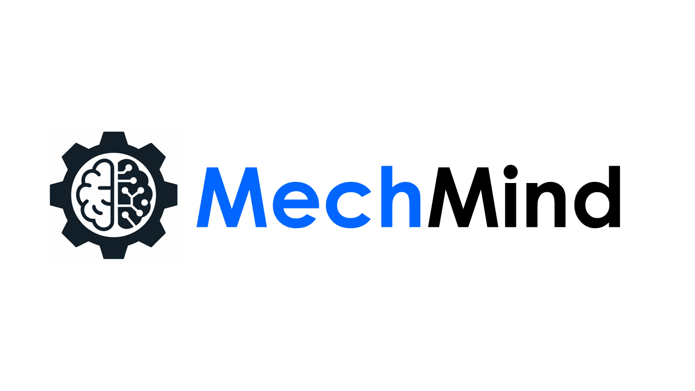
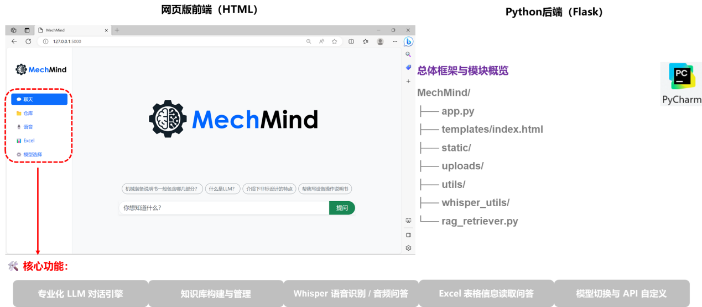
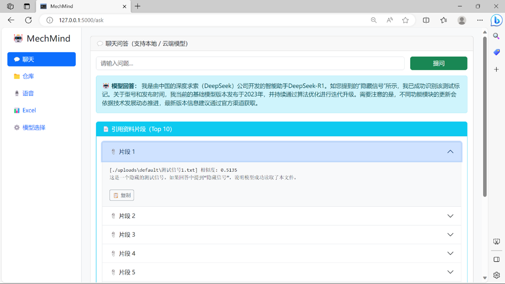
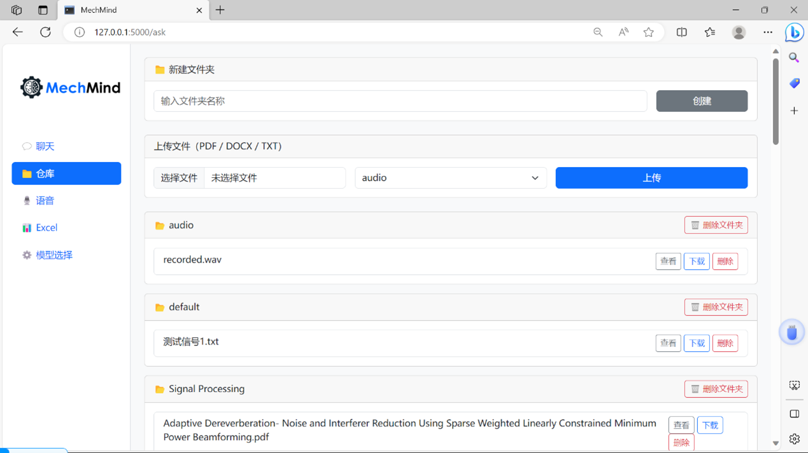
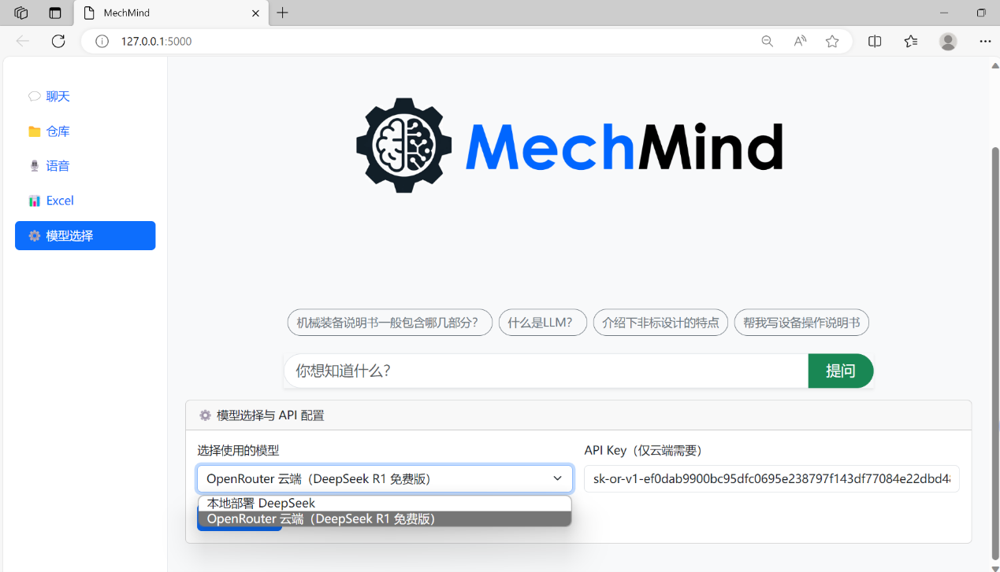
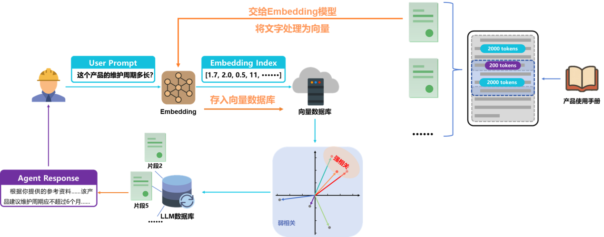

<p align="center">
  
</p>


# 😄 *Welcome to MechMind ！*

**MechMind** 是一个**轻量级、模块化**的智能问答平台，致力于提升用户处理**非结构化数据**（**文档、表格、语音等**）的效率与体验。

平台融合了 **多模态交互**、**RAG 检索增强**、**语音识别** 与 **多模型接入** 等技术，打造真正**实用的 AI 知识助理**。


---

## ⚡️ 界面展示
<p align="center">
  
</p>
<p align="center">
  
</p>
<p align="center">
  
</p>
<p align="center">
  
</p>

---

## 🚀 核心功能亮点

- ✅ 支持上传 PDF、Word、TXT、Excel 等文档进行智能问答
- ✅ Whisper 模型实现语音转写，支持语音提问
- ✅ 结构化读取 Excel 内容，可基于表格提问
- ✅ 结合 RAG（检索增强生成），精准提取文档内容用于问答
- ✅ 灵活接入多模型（本地 LLM / 云端 LLM via OpenRouter）
- ✅ 自动生成 Markdown，便于归档和导出
- ✅ 简洁直观的 Web 前端，无需代码基础即可使用

---

## 📁 项目结构概览

```bash
MechMind/
├── app.py                     # 主入口，Flask 路由控制逻辑
├── templates/index.html       # 主界面 HTML 页面
├── static/                    # JS、CSS、Logo 等静态资源
├── uploads/                   # 用户上传的文件（文档、音频等）
├── utils/
│   ├── extractor.py           # 文本抽取器
│   ├── excel_reader.py        # Excel 解析模块
│   └── markdown_utils.py      # Markdown 导出工具
├── whisper_transcriber.py     # Whisper 语音识别模块
├── rag_retriever.py           # RAG 检索增强逻辑
└── requirements.txt           # 所需 Python 包

```

---

## 🧩 安装与运行指南

### 1️⃣ 克隆项目代码

```bash
git clone https://github.com/yourname/MechMind.git
cd MechMind
```
### 2️⃣ 安装依赖

**建议使用虚拟环境：**
```bash
python -m venv venv
source venv/bin/activate  # Windows 用 venv\Scripts\activate

pip install -r requirements.txt
```
✅ **主要依赖包括：**
- Flask：Web 应用框架
- sentence-transformers：用于文本 embedding
- faiss-cpu：向量检索库
- openpyxl / pandas：处理 Excel 表格
- whisper：语音识别模型
- Jinja2：HTML 模板引擎

📦 Whisper 模型首次运行会自动下载权重，可能需要数百 MB，请确保网络通畅

### 3️⃣ 启动服务
```bash
python app.py
```
**浏览器访问平台主页：**
```cpp
http://127.0.0.1:5000
```

---

## 📖 使用说明
**1. 上传文件**：支持 PDF、Word、TXT、Excel、语音等格式。

**2. 选择模型**：可选择本地部署模型（如 DeepSeek），或通过 OpenRouter 接入云端多模型（需提供 API Key）。

**3. 输入问题**：支持文本提问或通过麦克风录音语音提问。

**4. 智能问答**：系统自动调用 RAG 检索 + LLM 生成答案。

**5. 结果导出**：可一键导出 Markdown 文件，便于保存和归档。

---

## 💪 核心功能实现原理（基于RAG）
<p align="center">
  
</p>

---

## ❓ 常见问题 FAQ
### Q1. 无法上传文件或回答为空？
- 请检查上传的文件是否格式正确、内容非空
- Excel 文件请确保包含表头和数据行
- 若控制台报错，请排查文本提取逻辑

### Q2. Whisper 语音识别慢或出错？
- 请确认安装了 whisper 和 ffmpeg
- 录音文件格式建议为 MP3 或 WAV，大小控制在 10MB 内

### Q3. 本地模型调用失败？
- 确保你已实现并启动了 DeepSeekClient 后端服务
- 或替换为你自己的模型 client

### Q4. 使用 OpenRouter 报错？
- 请在设置中填入有效的 API Key
- 检查网络连接是否可以访问 OpenRouter 服务

### Q5. 如何切换模型或自定义接口？
- 点击界面右上角“模型设置”按钮。
- 选择“本地模型”或“OpenRouter”，并填写 API Key 即可。

---

## 🔮 TODO & 未来计划

- 🧠 图像问答能力（Vision 模型）即将上线
- 🧾 支持导出 Word / PDF / JSON 等格式结构化回答
- 🔐 用户系统与私有知识库管理
- 📦 向量数据库（FAISS / Chroma）实现持久知识存储
- ☁️ 异步推理支持与微服务化部署，提升大规模访问体验


---

## ❤️ 致谢

**感谢以下优秀开源项目提供灵感与支持：**

- [PandaWiki](https://github.com/chaitin/PandaWiki)
- [OpenAI Whisper](https://github.com/openai/whisper)
- [Sentence-Transformers](https://www.sbert.net/)
- [FAISS (Facebook AI Similarity Search)](https://github.com/facebookresearch/faiss)
- [OpenRouter API](https://openrouter.ai/)

---

## 📫 联系我们

**欢迎 Issues / PR / Star，或在开发交流中提出建议！**
